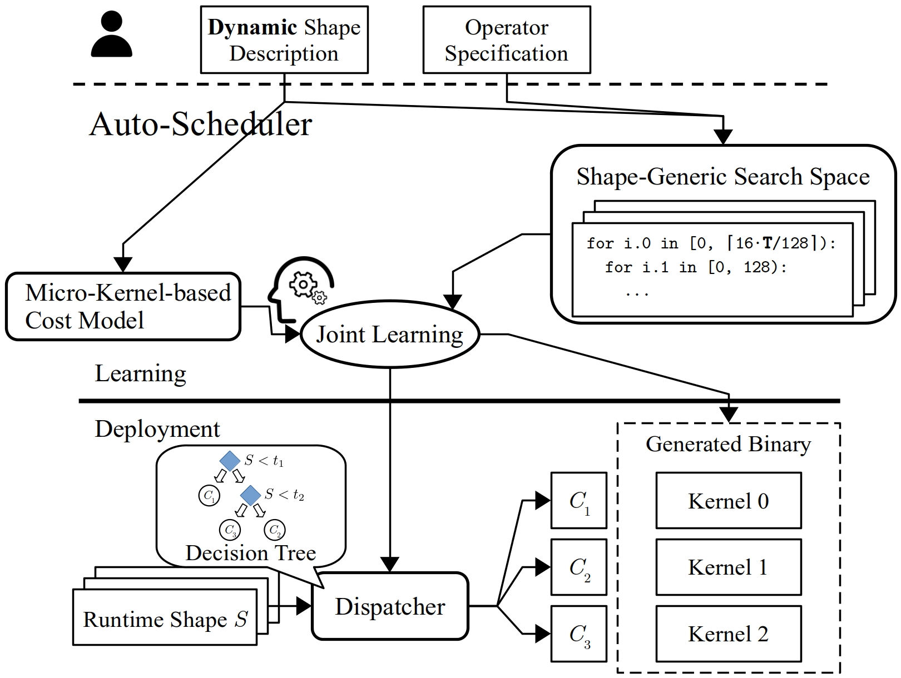

- Feature Name: DietCode: An Auto-Scheduler for Dynamic Tensor Programs
- Start Date: (2022-05-10)
- RFC PR: [apache/tvm-rfcs#xx](https://github.com/apache/tvm-rfcs/pull/xx)
- GitHub Issue: [apache/tvm#yy](https://github.com/apache/tvm/pull/yy)

# Summary
[summary]: #summary

We propose to integrate DietCode, an auto-scheduler for dynamic tensor programs,
to AutoTIR. DietCode offers the following features:
- A shape generic search space to cover all possible shapes in dynamic shape
  workloads.
- An improved cost model to judge the quality of schedule candidates based on
  dynamic shape.
- Some improvements to the TVM CUDA codegen to achieve better performance with
  imperfect tiling.

DietCode has been published by MLSys 2022 so please see [the
paper](https://proceedings.mlsys.org/paper/2022/hash/fa7cdfad1a5aaf8370ebeda47a1ff1c3-Abstract.html)
for more details and evaluations. Meanwhile, DietCode itself is also publicly
available [here](https://github.com/UofT-EcoSystem/DietCode).

# Motivation
[motivation]: #motivation

Achieving high performance for compute-intensive operators in machine learning
workloads is a crucial but challenging task. Many machine learning and system
practitioners rely on vendor libraries or auto-schedulers to do the job. While
the former requires large engineering efforts, the latter only supports
static-shape workloads in existing works. It is difficult, if not impractical,
to apply existing auto-schedulers directly to **dynamic-shape workloads**, as
this leads to extremely long auto-scheduling time.

We observe that the key challenge faced by existing auto-schedulers when
handling a dynamic-shape workload is that they cannot construct a unified search
space for all the possible shapes of the workload, because their search space is
shape-dependent. To address this, this RFC aims to add dynamic-shape supports to
AutoTIR by integrating DietCode framework, which constructs **a shape-generic
search space and cost model** to auto-schedule dynamic-shape workloads
efficiently.

Our evaluation shows that DietCode has the following key strengths when
auto-scheduling an entire model end-to-end: 

1. reduces the auto-scheduling time by up to 5.88x less than the current
auto-scheduler on 8 uniformly sampled dynamic shapes, and
1. improves performance by up to 69.5% better than the auto-scheduler and 18.6%
better than the vendor library. All these advantages make DietCode an efficient
and practical solution for dynamic-shape workloads.


# Guide-Level Explanation
[guide-level-explanation]: #guide-level-explanation

We implemented and experimented DietCode based on the current auto-scheduler
submodule, so the following example is based on it as well. However, we plan to
integrate this RFC to AutoTIR (MetaScheduler).

```Python
T, T_vals = tir.ShapeVar('T’), list(range(1, 128))

task = SearchTask(func=Dense, args=(16*T, 768, 2304),
                  shape_vars=(T,), wkl_insts=(T_vals,)
                  wkl_inst_weights=([1. for _ in T_vals],))

tune_option = TuningOptions(
                  num_measure_trials=auto_sched_ntrials,
                  runner=local_rpc_measure_ctx.runner,
                  measure_callbacks=[RecordToFile(sched_log_fname)]
              )
search_policy = SketchPolicy(search_task, XGBModel())

search_task.tune(tune_option, search_policy)
```

To enable auto-scheduling for dynamic shape workloads, users only need to:
1. Have `ShapeVar` in the TE/TensorIR computes.
1. Specify the weight of each shape value.

Note that the proposed interface is optional, so it will not break any existing
code.


# Reference-Level Explanation
[reference-level-explanation]: #reference-level-explanation

Here is an overview of the DietCode framework design.



- We construct **a shape-generic search space that consists of micro-kernels**,
  an incomplete program that carries out a tile of the complete computation, to
  efficiently support dynamic-shape workloads. 
  
  We use the hardware constraints (e.g., the maximum number of threads, the
  amount of shared and local memory) rather than the shape information to
  determine the micro-kernel candidates. Those candidates serve as the building
  blocks and are executed repeatedly to carry out a workload instance (defined
  as an static-shape instance of the dynamic-shape workload).
- 
- 

# Drawbacks
[drawbacks]: #drawbacks

// Discuss a bit about the op coverage and binary size.

# Rationale and Alternatives
[rationale-and-alternatives]: #rationale-and-alternatives

There is an approach proposed by [Nimble](https://arxiv.org/pdf/2006.03031.pdf),
which partitions a range of dynamic shape to buckets and tunes one kernel for
each bucket. We could, of course, implement this approach to the current
auto-scheduler and AutoTIR. However, as evaluated in the DietCode paper, this
approach is not guaranteed to achieve better performance as static shapes.

# Prior State-of-the-Arts
[prior-sotas]: #prior-sotas

// Brorrow some related work from the paper.

- Ansor: ...
- 


# Unresolved Questions
[unresolved-questions]: #unresolved-questions

// I tried to list one but you could write whatever in your mind.

- Limited dynamic shape dimension.
- ...

# Future Possibilities
[future-possibilities]: #future-possibilities

// I tried to list some but you could write whatever in your mind.

- Evaeluate more ops.
- CPU support.

# Upstreaming Milestones

We propose the following milestones for upstreaming, where each bullet point
corresponds to a PR with unit tests of roughly several hundred lines.

- [ ] Code Generation Support
  - Local Padding
  - Loop Partitioning
- [ ] Auto-Scheduler
  - Frontend Interface
  - Sketch Generation
  - Random Annotations
  - Program Measurer
  - Micro-Kernel Cost Model
  - Evolutionary Search
- [ ] Dynamic-Shape Program Compilation
- [ ] Decision-Tree Dispatching
