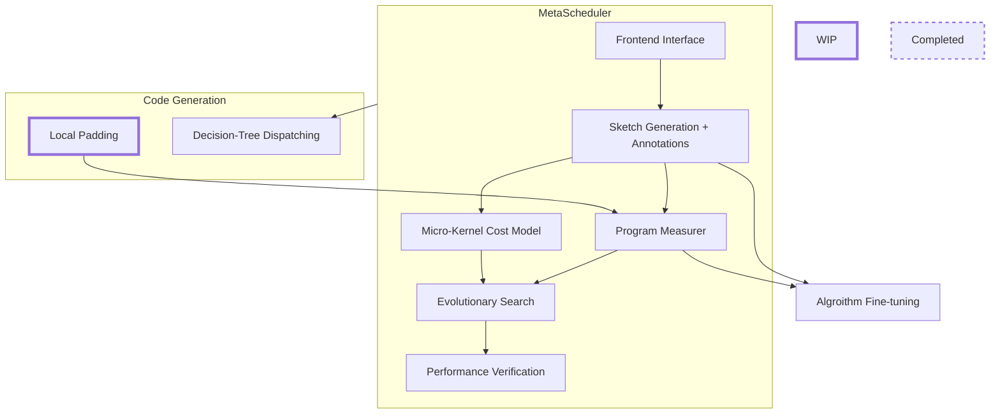

*This issue is to track progress for DietCode.*

# TODO Items

- [ ] Code Generation Support
  - [ ] Local Padding
    <details>
      
    #### Description
    
    Pad tensors by the size of the local workspace so that predicates in the
    compute stage can be safely removed without affecting correctness. This
    eliminates the performance overhead of those predicates.

    #### Implementation Outline
    
    The local padding will be implemented as a transformation **pass**. The pass
    will automatically pad local tensors (`__shared__` variables with the
    current GPU sketch rules) and remove all the predicates in the compute
    stage. It will be invoked as part of the post-processing pipeline in the
    case of dynamic workloads.

    #### Expected Outcome
    
    <table>
      <tr>
        <th>Before Transformation</th>
        <th>After Transformation</th>
      </tr>
      <tr>
      <td>
        
      ```CUDA
      __shared__ float A_shared[80];
      float B_local[80];
      
      for (int i = 0; i < 100; ++i) {
        if (i < 80) {
          A_shared[i] = A[...];
        }
        if (i < 80) {
          B_local[i] = A_shared[i];
        }
        if (i < 80) {
          B[...] = B_local[i];
        }
      }
      ```
        
      </td>
      <td>
      
      ```CUDA
      __shared__ float A_shared[80];
      float B_local[80];
      
      for (int i = 0; i < 100; ++i) {
        A_shared[i] = i < 80 ? A[...] : 0 /* the value used in the initialization step */;
        B_local[i] = A_shared[i];
        if (i < 80) {
          B[...] = B_local[i];
        }
      }
      ```
      
      </td>
      </tr>
    </table>
    
    See [**here**](https://github.com/UofT-EcoSystem/DietCode/blob/main/tests/codegen/saved_artifacts/test_local_padding.cu#L85-L92) for a more concrete example.

    #### [Further Discussions](https://gist.github.com/junrushao1994/c8f48d818616d11402c8aa65082f5b47)
  
  </details>
  
  - <del>[ ] Loop Partitioning</del>
    
    Comment: *We temporarily skip this workitem for now as loop partitioning and
    local padding share the same functionality (i.e., remove the performance
    overhead brought by predicates)*.
- [ ] Meta-Schedule
  - [ ] Frontend Interface
    <details>
  
    #### Description
  
    Support integer shape variables as part of the module declarations, also add
    to tuning configurations the ability to specify workload instances and their
    respective weights. 
   
    #### Expected Outcome
  
    ```Python
    @T.prim_func
    def Dense(a: T.handle, b: T.handle, c: T.handle, M: int, N: int, K: int) -> None:
        A = T.match_buffer(a, [M, K])
        B = T.match_buffer(b, [K, N])
        C = T.match_buffer(c, [M, N])
        for i, j, k in T.grid(M, N, K):
            with T.block("update"):
                vi, vj, vk = T.axis.remap("SSR", [i, j, k])
                with T.init():
                    C[vi, vj] = 0.0
                C[vi, vj] = C[vi, vj] + A[vi, vk] * B[vk, vj]

    tune_tir(mod=Dense,
             config=TuneConfig(
                 wkl_insts=[(5, 5, 5), (10, 10, 10), ...],
                 wkl_inst_weights=[1., 1., ...]
                 ...
             ))
    ```
    
    #### [Further Discussions](https://gist.github.com/junrushao1994/d4e093cc490f58f06c260118f58e6679)
    </details>
  - [ ] Sketch Generation + Annotations
    <details>
  
    #### Description
    
    Change the sketching generation and annotation instructions to support
    dynamic workloads.
    
    #### Implementation Outline
    
    The behavior of the existing sketch generation and random annotation rules
    have to be changed in the case of dynamic workloads. Specifically, two key
    modifications are necessary:
    - It is no longer appropriate to sample perfect tile sizes of each
      individual loop due to the fact that its extent can be dynamic. Instead,
      we expect that tile sizes are sampled based on the maximum loop extents
      plus the hardware constraints (number of threads per block, maximum
      vthreads, maximum innermost factors etc.). 
    
      See
      [**here**](https://github.com/UofT-EcoSystem/DietCode/blob/MLSys2022_AE/tvm/src/auto_scheduler/search_policy/utils.cc#L605-L1019)
      for the detailed sampling algorithm that we use. Note that compared with
      the current sampling approach, there are two key differences:
      1. **All the tile sizes are sampled jointly rather than individually.**
      1. **The tuning configurations (`target` to be more specific) affect how
         the tile sizes are selected.** Tile sizes that do not meet the target
         constraints are filtered out.
    
      The algorithm details can be discussed later. As a starting
      implementation, we could still use the perfect tile sizes sampled from the
      largest loop extents, but this should be improved in a later stage to
      cover for cases where the loop extents do not have a sufficient number of
      factors (e.g., being a prime number).
    
    - **The unrolling factor should NOT be sampled from a discrete set of values
      (e.g., 0, 16, 64, ...). Instead, it should be always be the product of all
      the inner tile sizes.** This is because nvcc implicitly unrolls the
      compute body in the case when it does not contain predicates. However,
      upon handling dynamic workloads, it is possible that one workload instance
      fits perfectly into the schedule tile sizes but not the others. To
      guarantee the exact same code generation behavior of nvcc, we request that
      all the inner loops should be explicitly unrolled.
    
    #### Expected Outcome
    
    <table>
      <tr>
        <th>Current</th>
        <th>Proposed</th>
      </tr>
      <tr>
      <td>
        
      ```Python
      l1, l2, l3 = sch.get_loops(block=b0)
      v1, v2, v3, v4, v5  = sch.sample_perfect_tile(128, n=5, decision=[4, 1, 16, 1, 2])
      v6, v7, v8, v9, v10 = sch.sample_perfect_tile(128, n=5, decision=[1, 2, 16, 1, 2])
      v11, v12, v13 = sch.sample_perfect_tile(128, n=3, decision=[16, 2, 4])
      v14 = sch.sample_categorical(
                candidates=[0, ..., 1024],
                probs=[0.2, 0.2, 0.2, 0.2, 0.2],
                decision=2
            )
      sch.annotate(block_or_loop=b1, ann_key="meta_schedule.unroll_explicit", ann_val=v14)
      ```
        
      </td>
      <td>
      
      ```Python
      l1, l2, l3 = sch.get_loops(block=b0)
      ((v1-5), (v6-10), (v11-13)) = sch.sample_target_constrained_tiles(
                                        [128, 128, 128], ns=[5, 5, 3],
                                        decision=[[None, 1, 16, 1, 5], 
                                                  [None, 3, 8, 1, 1], 
                                                  [None, 1, 16]]
                                    )
      sch.annotate(block_or_loop=b1, ann_key="meta_schedule.unroll_explicit", ann_val=v2*v4*v5*v7*v9*v10*v12*v13)
      ```
      
      </td>
      </tr>
    </table>
    
    </details>
  - [ ] Program Measurer
    <details>
    
    #### Description
    
    Measure the compute throughput of a schedule (i.e., micro-kernel) so as to
    prepare for an accurate prediction of the relationship between the compute
    throughput and the shape dimension (i.e., `blockIdx`). 
    
    #### Implementation Outline
    
    The graph below illustrates how the compute throughput of a micro-kernel
    changes w.r.t. the shape dimension. The hardware platform is a single
    machine equipped with RTX 3090 (82 streaming processors (SMs)) and the
    compute workload is a dense layer. It can be seen from the example that we
    request two data points for accurate prediction: (1) `blockIdx=SM` and (2)
    `blockIdx=2*SM` where *2* is the number of thread blocks that can be
    executed on one SM (can be obtained from the nvcc compilation report).
    
    
    
    #### Expected Outcome
    
    The program builder should generate and save the nvcc compilation reports
    when building each kernel. This includes the number of threads, the number
    of registers per thread, and the amount of shared memory per thread block.
    Those three numbers collectively decide the number of threads blocks per SM.
    
    The program measurer should measure the compute throughput when
    `blockIdx=SM` and `N*SM` (where `N` is the number of thread blocks per SM).
    </details>
  - [ ] Micro-Kernel Cost Model
    <details>
    
    #### Description
    
    Predicate the performance of the micro-kernel across all workload instances.
    
    #### Implementation Outline
    
    Change the interface of the cost model so that it outputs a matrix rather
    than a vector. The matrix has dimension [number of micro-kernels × number of
    workload instances] and each entry of it represents the predicted compute
    throughput of micro-kernel *M* operating on workload instance *W*.
  
    #### Expected Outcome
    
    <table>
      <tr>
        <th>Current</th>
        <th>Proposed</th>
      </tr>
      <tr>
      <td>
        
      ```Python
      def predict(self, search_task, states):
        
        ...
        
        return scores_per_state
               # [num_states]  
               # predicted compute throughput of each state
      ```
        
      </td>
      <td>
      
      ```Python
      def predict(self, task, states):
        
        ...
        
        return adapt_state_to_workloads(scores_per_state)
               # [num_states × num_wkl_insts]  
               # predicted compute throughput of each workload instance
               # using each state (i.e., micro-kernel)
      ```
      
      </td>
      </tr>
    </table>
  
    </details>
  - [ ] Evolutionary Search 
    <details>
  
    #### Description
  
    Modify the tile sizes.
  
    #### Implementation Outline
    
    The mutation can be done similar to that of the existing auto-scheduler
    (i.e., sample a factor from one of the tiles and multiply it with another).
    Note that we do not mutate the tile sizes that are bound to `threadIdx` to
    respect the target constraints (this, again, can be discussed and amended in
    the future). 
    
    At the same time, the unrolling factors no longer need to be mutated due to
    the change in the sketch generation rules, but they should still follow the
    values of the tile sizes.
  
    #### Expected Outcome
    
    <table>
      <tr>
        <th>Before Mutation</th>
        <th>After Mutation</th>
      </tr>
      <tr>
      <td>
        
      ```Python
      l1, l2, l3 = sch.get_loops(block=b0)
      ... = sch.sample_target_constrained_tiles(
                [128, 128, 128], ns=[5, 5, 3],
                decision=[[None, 1, 16, 1, 5], 
                          [None, 3, 8, 1, 1], 
                          [None, 1, 16]]
            )
      ```
        
      </td>
      <td>
      
      ```Python
      l1, l2, l3 = sch.get_loops(block=b0)
      ... = sch.sample_target_constrained_tiles(
                [128, 128, 128], ns=[5, 5, 3],
                decision=[[None, 1, 16, 1, 9], 
                          [None, 5, 8, 1, 1], 
                          [None, 1, 19]]
            )

      ```
      
      </td>
      </tr>
    </table>
  
    </details>
  - [ ] Performance Verification
    <details>
    
    #### Description
    
    Verify the performance of the generated kernels before outputting them.
    
    #### Implementation Outline
    
    Because most of the auto-scheduling pipeline is done using predictions
    rather than actual measurements. We need to verify that the predicted
    throughputs are accurate before outputting them. This can be done by actually
    simply measuring each workload instance using its selected micro-kernel.
    
    This is a necessary step to guarantee that the actual performance numbers
    roughly match the predictions. Imaging one possible scenario: Micro-kernel
    *M* uses the exact same number of registers as is available on the device.
    It works fine in the case when the workload instances can perfectly match
    its tiling sizes. However, in the case when they cannot, extra predicates
    have to be injected in the compute body, which might increase the register
    usage, leading to spilling.
    </details>
- [ ] Decision-Tree Dispatching
  <details>

  #### Description
  
  Gather the IRModule's for all workload instances and put them into a single one that can be using on all shape instances.
  
  #### Implementation Outline
  
  One possible implementation is to do this using an IRModule pass. The pass
  extracts all device functions from the IRModule's while recording their
  corresponding invocations in the host function. It then uses a decision tree
  (from the scikit-learn Python package) to train a decision tree to learning
  the relationship between the shape instances and the device functions. The
  decision tree is exported in text format and embedded as part of the host
  function in the final generated IRModule.

  #### Expected Outcome
  
  <table>
    <tr>
      <th>Inputs</th>
      <th>Output</th>
    </tr>
    <tr>
    <td>
    
    - IRModule *A* (when shape *S<sub>A</sub>*):
      ```CUDA
      __global__ void device_function_0();
          
      device_function_0<<<...>>>();
      ```
    - IRModule *B* (when shape *S<sub>B</sub>*):
      ```CUDA
      __global__ void device_function_0();
          
      device_function_0<<<...>>>();
      ``` 
    - ...        
    </td>
    <td>
      
    ```CUDA
    __global__ void device_function_0();
    __global__ void device_function_1();  // renamed from IRModule B
    
    if (S <= S_A) {
      device_function_0<<<...>>>();
    } else {
      device_function_1<<<...>>>();
    }
    ```
    
    </td>
    </tr>
    </table>
    </details>

# Roadmap

